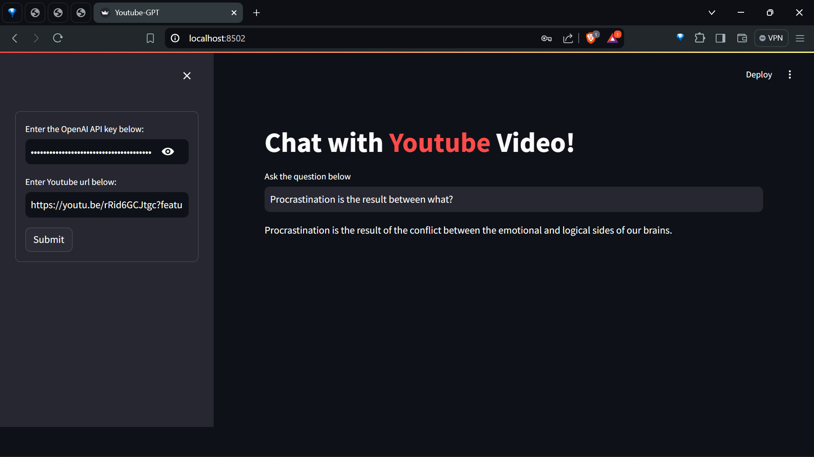

<p align="center">
  
</p>
<p align="center">
    <h1 align="center">YOUTUBE_DOUBT_SOLVER</h1>
</p>
<p align="center">
    <em>Solving YouTube queries effortlessly, doubt no more!</em>

<p align="center">
		<em>Developed with the software and tools below.</em>
</p>
<p align="center">
	
	
	
	
</p>
<hr>



##  Quick Links

> - [ Overview](#-overview)
> - [ Features](#-features)
> - [ Repository Structure](#-repository-structure)
> - [ Modules](#-modules)
> - [ Getting Started](#-getting-started)
>   - [ Installation](#-installation)
>   - [ Running youtube_doubt_solver](#-running-youtube_doubt_solver)
> - [ Conclusion](#-conclusion)

---

##  Overview

The youtube_doubt_solver project is a platform that leverages OpenAI models to answer user queries related to YouTube videos. The Dockerfile coordinates the setup process by managing Python dependencies and serving the frontend through Streamlit on a specified port. The frontend module interacts with users, processes their queries, and displays results in an interactive manner. The backend component integrates various functionalities such as document loading, text splitting, and similarity search to enhance the user experience by providing accurate answers. The project adds value by offering a seamless solution for resolving doubts and questions related to YouTube content.

---

##  Features

|    |   Feature         | Description |
|----|-------------------|---------------------------------------------------------------|
| ⚙️  | **Architecture**  | Built on a modular architecture with Docker for setup and Streamlit for the frontend, and OpenAI models for question answering. The backend handles document loading, text splitting, and similarity search efficiently. |
| 🔩 | **Code Quality**  | The codebase maintains good quality and style practices. It follows PEP guidelines and has clear and well-structured code. |
| 📄 | **Documentation** | Documentation is available in the form of a requirements.txt file specifying dependencies. More detailed documentation could improve understanding and usage. |
| 🔌 | **Integrations**  | Key integrations include OpenAI for question answering, langchain for language processing, and Streamlit for frontend display. External dependencies like faiss-cpu enhance functionality. |
| 🧩 | **Modularity**    | The project exhibits good modularity with clear separation between frontend and backend components. This allows for easy reusability and extension of functionalities. |
| 🧪 | **Testing**       | Testing frameworks and tools used are not explicitly mentioned in the provided details. Including testing tools like pytest would ensure code reliability and prevent regressions. |
| ⚡️  | **Performance**   | Efficiency is maintained through the use of OpenAI models and optimization techniques like text splitting and similarity search. Speed and resource utilization could be further improved based on specific performance benchmarks. |
| 🛡️ | **Security**      | Measures for data protection and access control are not clearly specified in the provided details. Integration of security practices like input validation and authentication mechanisms would enhance data security. |
| 📦 | **Dependencies**  | Key dependencies include openai, langchain, streamlit, faiss-cpu, and more listed in the requirements.txt file. Proper management of dependencies ensures smooth functioning of the project. |


---

##  Repository Structure

```sh
└── youtube_doubt_solver/
    ├── Dockerfile
    ├── README.md
    ├── backend.py
    ├── frontend.py
    └── requirements.txt
```

---

##  Modules

<details closed><summary>.</summary>

| File                                                                                                   | Summary                                                                                                                                                                                                                                                         |
| ---                                                                                                    | ---                                                                                                                                                                                                                                                             |
| [Dockerfile](https://github.com/manannainiwal/youtube_doubt_solver/blob/master/Dockerfile)             | Summary:** Dockerfile orchestrates setup for a YouTube doubt-solving platform by handling Python dependencies, serving frontend via Streamlit on a specified port in the repository.                                                                            |
| [frontend.py](https://github.com/manannainiwal/youtube_doubt_solver/blob/master/frontend.py)           | The code in frontend.py orchestrates user interface interaction for the Youtube Doubt Solver project. It connects with the backend to process user queries and display results interactively.                                                                   |
| [backend.py](https://github.com/manannainiwal/youtube_doubt_solver/blob/master/backend.py)             | Role:** `backend.py` orchestrates OpenAI models for question answering on YouTube videos. Integrates document loading, text splitting, and similarity search functionalities for efficient processing. Enhances user experience by generating accurate answers. |
| [requirements.txt](https://github.com/manannainiwal/youtube_doubt_solver/blob/master/requirements.txt) | Code Summary:****File:** `requirements.txt`**Role:** Specifies dependencies for YouTube Doubt Solver **Features:** Includes openai, langchain, streamlit, faiss-cpu, and more.                                                                                  |

</details>

---

##  Getting Started

***Requirements***

Ensure you have the following dependencies installed on your system:

* **Python**: `version x.y.z`

###  Installation

1. Clone the youtube_doubt_solver repository:

```sh
git clone https://github.com/manannainiwal/youtube_doubt_solver
```

2. Change to the project directory:

```sh
cd youtube_doubt_solver
```

3. Install the dependencies:

```sh
pip install -r requirements.txt
```

###  Running youtube_doubt_solver

Use the following command to run youtube_doubt_solver:

```sh
python frontend.py
```

---


## Conclusion

Youtube-GPT offers an innovative way to interact with YouTube video content by leveraging advanced language models. This project showcases the powerful combination of natural language processing, document management, and vector search technologies to create an intuitive and engaging user experience. By following the provided installation and usage instructions, users can easily set up and explore the capabilities of this application.

This project highlights the potential for integrating AI-driven solutions in various domains, offering a glimpse into the future of interactive content processing. We hope this demonstration inspires further exploration and development in the field of AI and natural language processing.

---
